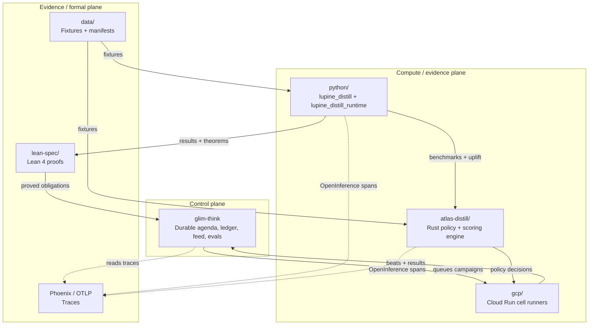

# Lupine Science System Architecture

This is the canonical map of how the repository's moving parts fit together. It is written for two audiences:

- **Research scientists** who want to know *where a claim lives*, *how evidence flows into it*, and *which code they should touch* to add a new benchmark or hypothesis.
- **Software engineers** who need to understand the deployable units, ownership boundaries, and how to run/tests each part.

## Design principle: one root, one owner

Every top-level directory should represent one deployable or working unit with a single clear owner. If two roots do the same thing, we consolidate. Retired roots move to `archive/`. The authoritative ledger is [`ROOTS.md`](../ROOTS.md).

The next ownership step is to split public surfaces into dedicated repos while
keeping the science/control-plane loop together. See
[`docs/repo-split-map.md`](./repo-split-map.md) and
[`ADR 0004`](./decisions/0004-public-surface-repo-split.md).

## The three planes

| Plane | Roots | Purpose |
| --- | --- | --- |
| **Control** | `glim-think/` | Durable intelligence: agenda, ledger, feed, evals, hypotheses, agent workflows. |
| **Compute** | `python/`, `atlas-distill/`, `gcp/`, `mlip_immi/` | Run benchmarks, compute uplift, enforce regime gates, apply Distill policy. |
| **Evidence** | `lean-spec/`, `data/`, traces in Phoenix | Formal specifications, shared fixtures, and reproducible telemetry. |

## Active roots in one sentence each

| Root | One-sentence purpose | Primary audience |
| --- | --- | --- |
| `glim-think/` | Durable research control plane that owns the agenda, ledger, and feed. | Agent/systems engineers |
| `atlas-distill/` | Rust engine for Distill scoring, policy, benchmark geometry, and fault-line extraction. | Rust engineers, MLIP methodologists |
| `python/` | Active Python packages for MLIP benchmarking, uplift, regime gating, and instrumented runtime. | Python engineers, research scientists |
| `lean-spec/` | Lean 4 formal specifications and proofs for materials-science claims. | Formal-methods contributors |
| `data/` | Shared benchmark fixtures and evidence manifests (kept small; large artifacts live in GCS/R2). | Everyone |
| `mlip_immi/` | Local real-data MLIP/IMMI analysis lane. | Research scientists |
| `library-site/` | Public Lupine Library site generator. | Frontend/communications |
| `atlas/` | LUPI molecular viewer and atomistic evidence surfaces. | Frontend engineers, scientists |
| `archive/` | Retired roots kept for provenance. | Historians, maintainers |

## Typical evidence flow

1. **Campaign launch** — `glim-think` creates a campaign and queues cells.
2. **Cell execution** — `gcp/mlip-cell-runner` runs an MLIP on a fixture.
3. **Python measurement** — `python/lupine_distill` computes metrics, uplift, and regime status.
4. **Rust policy** — `atlas-distill` evaluates the Distill policy decision.
5. **Formal gate** — `python/lupine_distill/odf/promotion_gate.py` applies the uplift + theorem check.
6. **Beat back to control plane** — results, traces, and claim updates land in `glim-think`.
7. **Proof obligation** — `lean-spec` holds the machine-checked theorems behind the claims.

## Entry points by job

| I want to... | Start here |
| --- | --- |
| Add a new MLIP benchmark | `python/lupine_distill/benchmark.py` + `python/scripts/run_ni_gpu_loop.py` |
| Add a new Distill policy rule | `atlas-distill/src/commands/distill_policy.rs` |
| Add a formal proof obligation | `lean-spec/OpenDistillationFactory/Materials/` |
| Add a claim to the ledger | `docs/templates/publication.md` → `glim-think` feed |
| Build the public Library | `library-site/README.md` |
| Inspect a molecule | `atlas/atlas-view/apps/web/` → `lupi.live` |

## What is *not* in this repo

- Marketing/start sites — retired to `archive/lupine-start/`.
- Duplicate Rust engines — the old `lupine-distill/` crate is archived; `atlas-distill/` is the single active engine.
- Standalone ODF KB — the old `distiller/` root is archived; active ODF contracts live in `python/lupine_distill/odf/`.

## See also

- [`ROOTS.md`](../ROOTS.md) — root ownership ledger and cleanup log
- [`docs/repo-split-map.md`](./repo-split-map.md) — planned public-surface repo split
- [`docs/ONBOARDING.md`](./ONBOARDING.md) — new-contributor tracks
- [`docs/decisions/`](./decisions/) — architectural decision records
- [`docs/navigation.md`](./navigation.md) — map of the research corpus
