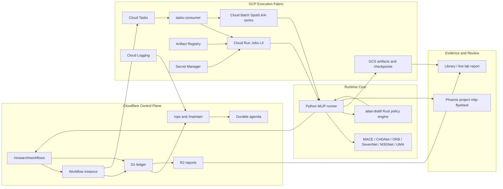
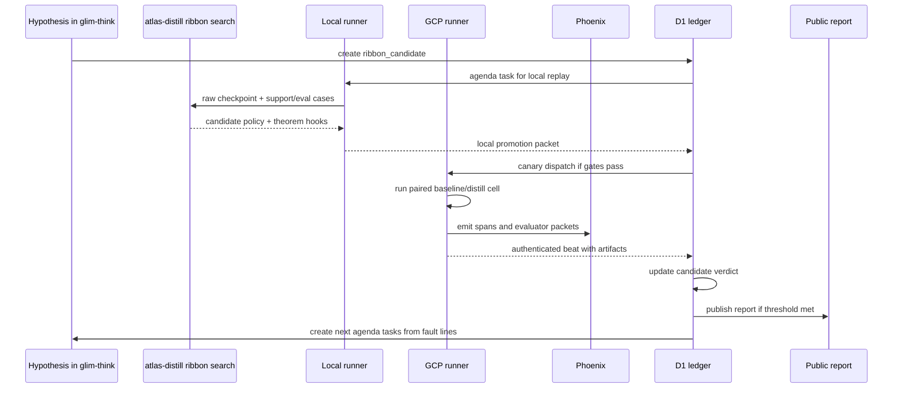

# MLIP Distill Evolution Architecture

Status: medium-term architecture draft
Date: 2026-05-27
Scope: GCP execution fabric for Lupine Distill evolution, with Cloudflare as the
durable research control plane

## Executive Thesis

Lupine Distill needs a system that can repeatedly answer one question:

> Did this new ribbon version help, hurt, refuse correctly, or merely move error
> around?

The system must be cheap enough to run often, reliable enough to trust after a
week unattended, and rigorous enough that a materials-science reviewer can trace
every reported lift back to a sealed fixture, model image, raw checkpoint,
ribbon version, evaluator result, and public artifact.

The architecture is intentionally split:

- Cloudflare is the durable brain: routes, workflow state, D1 ledger, R2 public
  reports, resource policy, agenda actions, and public-facing evidence.
- GCP is the elastic scientific instrument: Cloud Run Jobs for controlled L4 GPU
  cells, Cloud Batch or Spot GPU VMs for larger/checkpoint-heavy sweeps, GCS for
  immutable raw artifacts, Artifact Registry for images, Secret Manager for
  model tokens, and Cloud Logging/Monitoring for low-level diagnostics.
- Rust `atlas-distill` is the canonical policy core: versioned hyperribbon
  decisions, hill-climb/search, refusal logic, fault-line extraction, theorem
  hooks, and promotion gates.
- Python runners are interoperability shells: ASE, MLIP imports, device
  placement, model loading, relaxation execution, and checkpoint IO.
- Phoenix is the experiment observability home: spans, evaluator annotations,
  dataset/experiment grouping, trace links, and regression comparison. Phoenix
  does not own optimization policy.

The central rule is simple: GCP may execute work, but D1 remains the state
owner. GCP operation names, Cloud Tasks names, GCS URIs, image digests, and
Phoenix trace IDs are evidence fields.

## Evidence Conveyor

The first concrete conveyor is now encoded as
`data/mlip_benchmarks/evidence_campaigns/ni_lane_a_paired_accuracy_v1.json` and
validated by `tools/mlip_evidence_campaign.py`.

It rigs the evidence in the way the paper needs:

1. Source packet and sealed Ni fixture validate locally before any cloud command
   is emitted.
2. Five enabled MLIPs expand across five rows and two variants, producing 50
   scientific cells.
3. Each Distill Accuracy cell depends on the paired baseline cell for the same
   `(row, MLIP)`.
4. The pair shares one raw-prediction checkpoint URL. Baseline opens it
   read-write; Distill opens it read-only.
5. Distill cells carry a concrete support manifest, policy GCS URL, policy
   hash, Rust policy engine setting, and ribbon version.
6. The campaign materializes five Cloud Run batch specs, one per MLIP, so each
   execution can reuse a loaded calculator while still emitting per-cell beats.

The operator path is:

```powershell
python tools/mlip_evidence_campaign.py validate
python tools/mlip_evidence_campaign.py write-batches
python tools/mlip_evidence_campaign.py commands --kind upload
python tools/mlip_evidence_campaign.py commands --kind run-batch --wait
```

The check target is:

```powershell
just mlip-evidence-campaign-check
```

This does not replace the Cloudflare Workflow. It gives the Workflow a
first-principles evidence contract to import: cells, dependencies, batch specs,
checkpoint URIs, policy hashes, upload targets, and exact Cloud Run job names.
That is the bridge from architecture to claim-grade evidence.

## Platform Facts

These facts were last checked on 2026-05-27 against official docs.

- Cloud Run Jobs with GPUs support NVIDIA L4 GPUs with 24 GB VRAM. GPU memory is
  separate from instance memory, and Cloud Run GPU jobs require at least 4 CPU
  and 16 GiB memory. Cloud Run GPU jobs are a good default for bounded,
  reproducible MLIP cells.
- Cloud Run Jobs can split work into tasks, set a custom parallelism limit, use
  retries, and set task timeouts up to 168 hours. This is enough for most MLIP
  cells and canaries.
- Cloud Run L4 no-zonal-redundancy GPU pricing is published per second. The
  current public pricing table lists L4 no-zonal-redundancy at
  `$0.0001867 / second`, before CPU and memory charges. This keeps a single L4
  lane in the roughly-dollar-per-hour class, not supercomputer spend.
- Google Cloud Batch supports GPU jobs and is better suited when we need many
  tasks, VM-level control, Spot/flex-start behavior, or explicit driver/VM
  policy. Batch is the medium-term burst path, not the first default.
- Compute Engine Spot VMs can lower cost but can be preempted. GCP recommends
  dedicated preemptible GPU quota for GPU Spot use. Our design must assume
  interruption and make checkpoints first-class.
- Cloudflare Workflows are durable orchestration, not heavy compute. Workflow
  steps have durable wall-clock behavior, but non-stream step outputs are capped
  at 1 MiB and Workflows should not carry raw MLIP artifacts.

## System Map



## Workload Classes

### Class 0: Local Iteration

Purpose: develop new ribbons cheaply and fast.

Execution:

- local Python runner or isolated `uv` backend env;
- local `atlas-distill` binary;
- local JSONL artifacts in `tmp/mlip-local` and `tmp/mlip-benchmarks`;
- optional Phoenix dry-run or relay trace.

Promotion gate:

- source packet validates;
- fixture validates;
- raw checkpoint exists;
- no-harm gate passes on a small sealed triplet;
- promotion packet emits exact GCP canary command.

### Class 1: Cloud Run Job Cell

Purpose: reproducible canaries and normal 5x5x3 cells.

Default:

- Cloud Run Jobs in `us-central1`;
- one L4 GPU, 4 CPU, 16 GiB memory minimum;
- backend-specific images;
- one `(fixture, row, mlip, variant, ribbon)` cell per execution;
- checkpoint to GCS every N predictions or T seconds;
- post beat to `glim-think` and emit Phoenix spans.

This remains the default Lab lane because it is managed, auditable, fast to
start, and easy to cap.

### Class 2: Cloud Batch Sweep

Purpose: larger candidate sweeps, many fixture shards, or runs where Spot cost
savings justify preemption engineering.

Use when:

- the campaign exceeds comfortable Cloud Run regional L4 quota;
- cells require VM-level disk/cache control;
- we need lower cost via Spot/flex-start;
- the run can survive preemption from checkpoints.

Batch jobs should use the same runner contract and artifact schema as Cloud Run
Jobs. The only difference is the execution adapter and preemption policy.

### Class 3: HPC / External Lab Graft

Purpose: customer or national-lab stacks where we do not own the scheduler.

Contract:

- researcher keeps their MLIP/LAMMPS/ASE/HPC flow;
- Distill ships as Rust binary plus JSONL request/response contract;
- local sidecar emits the same cell artifacts and beats when network is
  available;
- offline export is accepted as a signed artifact bundle later imported into
  D1.

This is how the system avoids becoming "our cloud only."

## Evolution Loop



The flywheel is not "run a model and look at a leaderboard." It is:

1. propose a ribbon candidate from a hypothesis;
2. replay it locally on sealed checkpoints;
3. promote only if no-harm gates pass;
4. run a paired cloud canary;
5. classify lift, harm, refusal, and fault lines;
6. feed the next ribbon/search/theorem task.

## Data Model

D1 should carry small, queryable state. GCS/R2 carry large artifacts. Phoenix
carries trace/eval views.

### Tables

```text
ribbon_versions
  ribbon_id
  family
  version
  parent_ribbon_id
  spec_uri
  lean_spec_ref
  rust_commit
  created_at
  status

ribbon_candidates
  candidate_id
  ribbon_id
  objective
  source_hypothesis_id
  support_manifest_hash
  eval_manifest_hash
  policy_uri
  local_report_uri
  status
  verdict
  created_at

distill_campaigns
  campaign_id
  workflow_family
  fixture_id
  fixture_hash
  source_packet_id
  profile
  budget_policy_json
  status
  created_at
  completed_at

distill_cells
  cell_id
  campaign_id
  variant_id
  row_id
  mlip_id
  ribbon_id
  candidate_id
  execution_lane
  target_job
  status
  retry_count
  operation_name
  task_name
  checkpoint_uri
  artifact_uri
  phoenix_trace_id
  image_digest
  started_at
  completed_at

distill_cell_metrics
  cell_id
  accuracy_score
  accuracy_error
  speed_score
  duration_s
  force_calls
  intervention_rate
  refusal_rate
  harm_flags_json
  fault_classes_json

resource_allocations
  allocation_id
  campaign_id
  lane
  max_parallelism
  max_dollars_per_hour
  observed_dollars
  status
```

### Artifact URIs

```text
gs://shed-489901-atlas-inputs/mlip-fixtures/<fixture>/manifest.json
gs://shed-489901-atlas-inputs/mlip-policies/<ribbon>/<candidate>.json
gs://shed-489901-atlas-outputs/mlip-campaigns/<campaign>/<cell>/cell_result.json
gs://shed-489901-atlas-outputs/mlip-campaigns/<campaign>/<cell>/cell_checkpoint.json
gs://shed-489901-atlas-outputs/mlip-campaigns/<campaign>/<cell>/distill_events.jsonl
r2://glim-artifacts/reports/mlip/<campaign>/report.json
r2://glim-artifacts/reports/mlip/<campaign>/index.html
```

## Dispatch Design

Existing `tasks-consumer` should remain, but its role becomes an execution
adapter, not a workflow owner.

### Cloudflare Dispatch Packet

```json
{
  "schema": "lupine.distill.dispatch.v1",
  "campaign_id": "ni-lane-a-v1",
  "cell_id": "ni:v1:baseline:forces:chgnet",
  "target_job": "mlip-cell-chgnet",
  "execution_lane": "cloud_run_l4",
  "row_id": "forces",
  "mlip_id": "chgnet",
  "variant_id": "baseline",
  "ribbon_id": null,
  "candidate_id": null,
  "manifest_url": "gs://.../ni_fcc_eam_home_turf_v1.json",
  "artifact_prefix": "gs://.../ni-lane-a-v1/forces/chgnet/baseline",
  "checkpoint_url": "gs://.../ni-lane-a-v1/checkpoints/forces/chgnet.json",
  "beat_emit_url": "https://glim-think.../feed/beats",
  "budget_policy": {
    "max_dollars_per_hour": 20,
    "max_active_gpu_cells": 10,
    "preemptible_ok": false
  }
}
```

### Allowlist Rules

- `target_job` must be allowlisted.
- `manifest_url` must be an approved GCS prefix or signed input URL.
- `artifact_prefix` must be campaign-scoped.
- `variant_id=distill_accuracy` requires `ribbon_id`, `candidate_id`, and
  `policy_uri`.
- `variant_id=distill_accuracy_accelerate` requires an acceleration evaluator
  and must not reuse shared raw checkpoints for speed claims.

## Checkpointing

Checkpointing is the difference between "expensive experiment" and "scientific
instrument."

### Checkpoint Levels

```text
L0 raw prediction checkpoint
  one MLIP prediction per fixture case
  replayable by any ribbon candidate

L1 relaxation step checkpoint
  step, time, energy, forces, cell, positions
  enables resume and anytime evaluation

L2 campaign checkpoint
  cells complete/failed/stale
  queue cursor and retry decisions

L3 ribbon search checkpoint
  candidate beam, objective values, fault lines
  enables resuming atlas-distill search
```

### Write Policy

- Write raw prediction checkpoint after every 20 predictions or 60 seconds.
- Force-flush at cell completion.
- For relaxation/equilibrium-solve, write every N optimizer steps plus final.
- GCS writes are buffered to avoid 429 storms.
- Every checkpoint includes manifest hash, row id, MLIP id, variant, image
  digest, and source case hash.

### Resume Policy

- Baseline and Distill Accuracy may share L0 raw checkpoints when isolating
  accuracy. This is required for controlled comparisons.
- Distill Accuracy + Accelerate must use a separate protocol for speed claims.
- A stale cloud cell is resumed only if checkpoint context matches exactly.
- If context mismatches, refuse resume and open an ops action.

## Cost Architecture

The cost model should be boring, visible, and enforceable.

### Default Lab Profile

```json
{
  "profile": "lab-gcp-cloudrun-l4",
  "region": "us-central1",
  "gpu_type": "nvidia-l4",
  "gpu_count": 1,
  "cpu": 4,
  "memory_gib": 16,
  "max_dollars_per_hour": 20,
  "max_active_gpu_cells": 10,
  "max_task_timeout_hours": 6
}
```

### Escalation Profiles

```text
smoke
  no GPU, fixture and schema only

lab-gcp-cloudrun-l4
  default reproducible cell lane

lab-gcp-batch-spot-l4
  low-cost large sweeps with checkpointed interruption recovery

lab-gcp-batch-a100
  explicit high-power run for backends or fixture sizes that exceed L4

external-hpc-import
  no dispatch; import signed artifact bundle from a lab scheduler
```

### Budget Guard

Each campaign preflight computes:

```text
estimated_hourly =
  active_gpu_cells * (gpu_per_second + cpu_per_second * cpu + mem_per_second * mem_gib) * 3600
```

The workflow refuses dispatch if:

- estimated hourly spend exceeds policy;
- GPU quota is below requested parallelism;
- job image digest is missing;
- fixture hash is unknown;
- checkpoint prefix is not campaign-scoped;
- Phoenix project/evaluator packet is not configured for a release run.

## Diagnostics

This needs a Cloudflare-grade diagnostics surface: every failure should point to
the owner, the evidence, and the next action.

### `/ops` Snapshot

```json
{
  "campaign_id": "ni-lane-a-v1",
  "status": "partial",
  "cells": {
    "queued": 4,
    "running": 3,
    "complete": 38,
    "failed": 2,
    "stale_awaiting_beat": 1
  },
  "budget": {
    "max_dollars_per_hour": 20,
    "estimated_current": 7.42,
    "observed_total": 31.18
  },
  "diagnostics": [
    {
      "kind": "stale_awaiting_beat",
      "cell_id": "ni:v1:distill_accuracy:stress:orb-v3",
      "evidence": {
        "operation_name": "operations/...",
        "last_checkpoint_uri": "gs://...",
        "last_log_timestamp": "2026-05-27T12:00:00Z"
      },
      "recommended_action": "poll_gcp_operation_then_resume_from_checkpoint"
    }
  ]
}
```

### Failure Classes

```text
config_preflight_failed
quota_insufficient
image_digest_missing
backend_import_error
model_checkpoint_auth_error
manifest_hash_mismatch
checkpoint_context_mismatch
gcs_write_throttled
phoenix_emit_failed
beat_rejected
non_converged
force_explosion
cell_collapse
energy_drift
stress_explosion
oscillation
wrong_equilibrium
backend_runtime_error
```

### Logs To Keep

- Cloud Run execution name and job revision.
- Cloud Batch job/task id when used.
- Artifact Registry image digest.
- Runtime package versions.
- CUDA/GPU facts.
- GCS checkpoint flush count.
- Phoenix trace id/span ids.
- Per-case intervention trace.
- Refusal and blocked-correction reasons.

## Phoenix Contract

Phoenix is the organized home for observability and evaluator outputs.

Project:

```text
mlip-flywheel
```

Datasets:

```text
mlip-canonical-v2-heldout
ni-fcc-eam-home-turf-v1
hard-lane-ms25-v1
```

Experiments:

```text
baseline
distill_accuracy
distill_accuracy_accelerate
ribbon_candidate_<id>
```

Evaluators:

```text
physics.energy_delta
physics.force_rmse
physics.stress_mae
physics.elastic_cij_mae
physics.relaxation_stability
distill.leakage_guard
distill.intervention_trace
distill.refusal_policy
distill.no_harm_gate
distill.accuracy_delta
distill.speed_delta
theorem.ribbon_distance_bound
theorem.speedup_bound_observed
ops.artifact_completeness
ops.checkpoint_resume_integrity
```

Phoenix annotations should be derived from artifacts and ledger facts. They
should not re-run the gate or mutate candidate status.

## Novel Scheduling Solutions

### 1. Paired-Cell Co-Scheduling

For accuracy claims, schedule baseline and Distill Accuracy as a pair against
the same raw checkpoint. The scheduler treats the pair as one scientific unit:

```text
baseline raw prediction -> checkpoint -> distill replay -> paired evaluator
```

This reduces nondeterminism and makes "helped or hurt" precise.

### 2. Ribbon Shadow Mode

Before a ribbon is allowed to alter a run, it can run in shadow mode:

- baseline prediction executes normally;
- Distill policy receives the prediction and emits the decision it would have
  made;
- no corrected value is fed back into the MLIP path;
- evaluator compares shadow decisions to outcomes.

This is cheap risk discovery for new ribbons.

### 3. Fault-Line Harvesting

Every failed or refused case becomes a structured next-action candidate:

```text
fault_line -> support search -> theorem hook -> ribbon candidate -> local replay
```

This prevents negative results from becoming dead artifacts.

### 4. Checkpoint Market

Raw MLIP checkpoints are reusable research assets. The scheduler should prefer
new ribbon replays against existing checkpoints before spending GPU.

Policy:

- if fixture hash + row + MLIP + backend image digest match, replay locally or
  CPU-side first;
- if only ribbon changed, do not rerun MLIP inference;
- if backend image changed, rerun a small canary before trusting the cache.

### 5. Budget-Aware Region/Backend Router

Cloud Run L4 remains default. If L4 quota is low or queue pressure is high:

1. reduce parallelism;
2. shard campaign over time;
3. use Cloud Batch Spot only for checkpoint-safe cells;
4. use higher GPU classes only with explicit Lab approval.

## Security

### Identity

- Cloudflare mutating routes remain gated.
- Cloud Tasks calls to `tasks-consumer` are signed.
- GCP runner posts beats with Google OIDC identity.
- `glim-think` verifies issuer, audience, service account, campaign id, and cell
  id.
- Hugging Face or model-gated tokens live in Secret Manager, not D1/R2/GCS.

### Least Privilege

Runner service account can:

- read approved input GCS prefixes;
- write campaign-scoped output GCS prefixes;
- read only required secrets;
- emit logs and metrics;
- call the beat endpoint.

Runner service account cannot:

- mutate D1 directly;
- deploy jobs;
- read unrelated buckets;
- write public reports.

## Medium-Term Implementation Plan

### Phase 1: Contract Hardening

- Add `distill_evolution` workflow family in `glim-think`.
- Add D1 tables for ribbon versions, candidates, campaigns, cells, metrics, and
  resource allocations.
- Add source/fixture preflight using `data/mlip_benchmarks/manifest_sources.json`
  and sealed fixture hashes.
- Add paired baseline/Distill Accuracy campaign expansion.
- Add `/ops` diagnostics for stale beats, missing checkpoints, and budget
  violations.

### Phase 2: Cloud Run L4 Production Lane

- Ensure each MLIP job has image digest, package versions, CUDA facts, and Rust
  `atlas-distill` binary.
- Promote `ni-fcc-eam-home-turf-v1` as the first real Lane A fixture.
- Run paired MACE/CHGNet/ORB/SevenNet cells where backend auth/imports are
  healthy.
- Emit Phoenix evaluator packets into `mlip-flywheel`.
- Publish report JSON/HTML from D1 + GCS artifacts.

### Phase 3: Batch/Spot Lane

- Add a Cloud Batch execution adapter behind the same dispatch schema.
- Use only for checkpoint-safe sweeps.
- Add preemption and resume diagnostics.
- Add region/zone candidate list and quota scanner.
- Run a controlled 100-pair accuracy campaign only after Cloud Run canaries are
  green.

### Phase 4: External Lab Graft

- Define offline artifact bundle format.
- Add import endpoint and verifier.
- Support HPC-generated raw checkpoints and Distill event traces.
- Preserve the same Phoenix/dataset/evaluator vocabulary.

## Ready-To-Build Interfaces

```http
POST /research/workflows/distill-evolution/campaigns
GET  /research/workflows/distill-evolution/campaigns/:id
GET  /research/workflows/distill-evolution/campaigns/:id/ops
POST /research/workflows/distill-evolution/campaigns/:id/maintain
POST /research/workflows/distill-evolution/campaigns/:id/import
GET  /research/workflows/distill-evolution/ribbons
POST /research/workflows/distill-evolution/ribbons/:id/candidates
```

Default campaign body:

```json
{
  "profile": "lab-gcp-cloudrun-l4",
  "source_packet_id": "real-material-publication-v1",
  "fixture_id": "ni-fcc-eam-home-turf-v1",
  "variants": ["baseline", "distill_accuracy"],
  "mlips": ["mace-mp-0", "chgnet", "orb-v3", "sevennet"],
  "rows": ["energy_volume", "forces", "stress", "elastic_constants", "relaxation_stability"],
  "ribbon_candidate_id": "candidate-v3-energy-rooted",
  "max_dollars_per_hour": 20,
  "max_active_gpu_cells": 10,
  "require_paired_checkpoints": true
}
```

## Final Architecture Gate

The architecture is ready when this can run unattended:

1. Cloudflare creates a paired Distill Evolution campaign.
2. Preflight proves source packet, fixture hash, budget, quota, images,
   evaluators, and secrets.
3. GCP executes cells with checkpoints.
4. Phoenix receives traces and evaluator annotations in `mlip-flywheel`.
5. D1 marks each candidate as `promote`, `hold`, `harm`, or `refused_correctly`.
6. `/ops` exposes every stale or failed state with a repair action.
7. Public report shows paired accuracy, no-harm gates, refusal behavior, cost,
   artifact hashes, and exact limitations.

If any step is manual folklore, the system is not done.

## References

- Cloud Run Jobs with GPUs:
  https://docs.cloud.google.com/run/docs/configuring/jobs/gpu
- Cloud Run Jobs creation, parallelism, retries, and timeouts:
  https://cloud.google.com/run/docs/create-jobs
- Cloud Run pricing:
  https://cloud.google.com/run/pricing
- Cloud Batch GPU jobs:
  https://docs.cloud.google.com/batch/docs/create-run-job-gpus
- Compute Engine Spot VMs:
  https://docs.cloud.google.com/compute/docs/instances/spot
- Compute Engine GPU overview:
  https://docs.cloud.google.com/compute/docs/gpus/about-gpus
- Cloudflare Workflows limits:
  https://developers.cloudflare.com/workflows/reference/limits/
- Cloudflare Workflows pricing:
  https://developers.cloudflare.com/workflows/reference/pricing/
- Cloudflare Workers limits:
  https://developers.cloudflare.com/workers/platform/limits/
