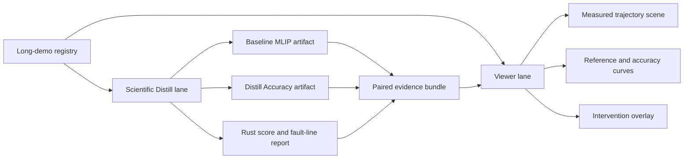

# MLIP Long-Horizon Demo Workstreams

Status: contract locked, awaiting measured runs.

This is the bridge between the scientific Distill system and the viewer. The
same demo id must exist in both streams:

- Scientific Distill owns the physics run, baseline/Distill pairing, reference
  contract, fault-line classification, and promotion gate.
- The viewer owns visual comprehension of the measured run: trajectories,
  overlays, curves, and clear awaiting-measurement states.

No viewer scene may invent atom motion, reference curves, hop events, or
intervention markers. If an artifact is absent, the viewer shows that absence.



## Registry

Source: `data/mlip_benchmarks/mlip_long_demo_registry.json`

Published viewer asset:
`library-site/src/reports/assets/mlip/mlip-long-demo-registry.json`

Validator:

```powershell
python tools\mlip_long_demo_registry.py --emit-viewer-manifest --fail-on-validation-error
```

The validator enforces:

- `mock_or_placeholder_allowed` is `false`.
- At least three long-horizon demos exist.
- Every demo has `scientific_distill` and `viewer` streams.
- Scientific and viewer claims remain false until measured artifacts exist.
- Measured artifacts cannot be marked mock or placeholder.

## Ribbon Prep

Source: `data/mlip_benchmarks/mlip_long_demo_ribbon_prep.json`

Published viewer asset:
`library-site/src/reports/assets/mlip/mlip-long-demo-ribbon-prep.json`

Validator:

```powershell
python tools\mlip_long_demo_ribbon_prep.py --emit-viewer-manifest --fail-on-validation-error
```

This is the real-run flight plan. For every demo it locks:

- the demo-specific ribbon id;
- reference-lock requirements before active correction;
- support/eval leakage guard;
- allowed correction coordinates;
- stiff axes to preserve;
- acceptance thresholds;
- refusal triggers;
- theorem hooks;
- viewer layers that can render only from measured artifacts.

Current readiness:

- Ni vacancy: local shadow run ready after reference source lock.
- HCP Mg slip: local shadow run ready after path protocol lock.
- LiFePO4 Li channel: blocked until the source structure, migration coordinate,
  and channel graph are locked.

## Demo Set

### 1. Ni Vacancy Diffusion

Why: Ni is an EAM home-turf problem. If Distill wins here, the claim is more
credible because the classical baseline is strong.

Science lane:
run vacancy MD with paired baseline and Distill Accuracy, score hop events,
diffusion trend, energy drift, local-force stability, and reference-error delta.

Viewer lane:
render measured vacancy motion, missing-site marker, neighbor distortion,
intervention timestamps, and hop-rate or Arrhenius curves only after data exists.

### 2. HCP Mg Slip and Stacking Fault

Why: HCP mechanics exposes anisotropic defect paths where fitting easy elastic
numbers is not enough.

Science lane:
apply controlled basal/prismatic shear offsets, run paired relaxations or short
MD, score stacking-fault energy path shape, stress response, stiff-axis drift,
and projected-ribbon refusal.

Viewer lane:
render the measured sheared cell, slip-plane guide, force/stress overlays, and a
reference curve only after source values are locked.

### 3. LiFePO4 Lithium-Channel Migration

Why: This deliberately leaves EAM comfort and tests whether Distill can stabilize
complex ionic transport where DFT-trained MLIPs matter.

Science lane:
perturb Li site occupancy or migration coordinate, run paired trajectories, then
score migration barrier/path error, site occupancy, nonphysical jumps, and force
stability.

Viewer lane:
render measured Li motion through channels, occupancy states, intervention
events, and migration-path error against locked references.

## First Build Order

1. Lock reference sources and small local fixture protocols for each demo.
2. Run local baseline/Distill pairs with the existing Python MLIP harness.
3. Score equilibrium or MD observables in Rust.
4. Publish paired artifacts to the Live Lab registry.
5. Promote only demos with measured science artifacts and measured viewer
   artifacts for the same protocol.

## Claim Boundary

These demos support a stronger public story only after the artifacts exist. The
current registry is a scientific operating contract, not an accuracy result.
